# Database ER Diagram

This diagram represents the MongoDB/Mongoose data model and relationships used by the backend.

```mermaid
erDiagram
    ROLE {
        ObjectId _id PK
        string roleId UK
        string roleName UK
        boolean canRead
        boolean canWrite
        boolean canUpdate
        boolean canDelete
        boolean isActive
        ObjectId createdBy FK
        datetime createdAt
        datetime updatedAt
    }

    USER {
        ObjectId _id PK
        string userId UK
        ObjectId roleReference FK
        string userName
        string email UK
        string passwordHash
        boolean isActive
        ObjectId createdBy FK
        datetime createdAt
        datetime updatedAt
    }

    CUSTOMER {
        ObjectId _id PK
        string customerId UK
        string name
        string phoneNumber
        string email UK
        string address
        string doorNo
        string block
        string apartmentName
        string landmark
        string area
        string city
        string pincode
        boolean isActive
        ObjectId createdBy FK
        datetime createdAt
        datetime updatedAt
    }

    BATHROOM_COUNT {
        ObjectId _id PK
        string bathroomCountId UK
        number bathroomCount
        boolean isActive
        ObjectId createdBy FK
        ObjectId updatedBy FK
        datetime createdAt
        datetime updatedAt
    }

    SERVICE_DURATION {
        ObjectId _id PK
        string serviceDurationId UK
        number durationMinutes
        boolean isActive
        ObjectId createdBy FK
        datetime createdAt
        datetime updatedAt
    }

    SERVICE_FREQUENCY {
        ObjectId _id PK
        string serviceFrequencyId UK
        string frequencyName
        number intervalDays
        boolean isActive
        ObjectId createdBy FK
        datetime createdAt
        datetime updatedAt
    }

    SUBSCRIPTION_TYPE {
        ObjectId _id PK
        string subscriptionTypeId UK
        string subscriptionName
        number timeGap
        boolean isActive
        ObjectId createdBy FK
        datetime createdAt
        datetime updatedAt
    }

    TIME_SLOT {
        ObjectId _id PK
        string timeSlotId UK
        string startTime
        string endTime
        number bufferTime
        boolean isActive
        ObjectId createdBy FK
        datetime createdAt
        datetime updatedAt
    }

    PAYMENT_METHOD {
        ObjectId _id PK
        string paymentMethodId UK
        string paymentMethodName
        boolean isActive
        ObjectId createdBy FK
        datetime createdAt
        datetime updatedAt
    }

    PAYMENT_ACCOUNT {
        ObjectId _id PK
        string paymentAccountId UK
        string accountName
        boolean isActive
        ObjectId createdBy FK
        datetime createdAt
        datetime updatedAt
    }

    PAYMENT_MASTER {
        ObjectId _id PK
        string paymentMasterId UK
        number cgstRate
        number sgstRate
        number discountRate
        datetime effectiveFrom
        datetime effectiveTo
        boolean isActive
        ObjectId createdBy FK
        datetime createdAt
        datetime updatedAt
    }

    PRICING {
        ObjectId _id PK
        string pricingId UK
        ObjectId serviceDurationReference FK
        ObjectId serviceDurationId FK
        ObjectId bathroomCountReference FK
        ObjectId bathroomCountId FK
        number price
        datetime effectiveFrom
        boolean isActive
        ObjectId createdBy FK
        datetime createdAt
        datetime updatedAt
    }

    BOOKING_DATE {
        ObjectId _id PK
        string bookingDateId UK
        datetime startDateTime
        datetime endDateTime
        boolean isActive
        ObjectId createdBy FK
        datetime createdAt
        datetime updatedAt
    }

    BOOKING {
        ObjectId _id PK
        string bookingId UK
        ObjectId customerReference FK
        ObjectId bathroomCountReference FK
        ObjectId pricingReference FK
        ObjectId serviceDurationReference FK
        ObjectId serviceFrequencyReference FK
        ObjectId subscriptionTypeReference FK
        ObjectId timeSlotReference FK
        ObjectId paymentMethodReference FK
        ObjectId paymentAccountReference FK
        string transactionId
        datetime scheduledDate
        datetime startDateTime
        datetime endDateTime
        number amount
        string completionPhoto
        boolean isPending
        boolean isCompleted
        boolean isCancelled
        boolean isActive
        ObjectId createdBy FK
        datetime createdAt
        datetime updatedAt
    }

    SUBSCRIPTION {
        ObjectId _id PK
        string subscriptionId UK
        ObjectId bookingReference FK
        ObjectId customerReference FK
        ObjectId pricingReference FK
        ObjectId serviceFrequencyReference FK
        ObjectId subscriptionTypeReference FK
        datetime startDate
        datetime endDate
        number totalVisits
        number completedVisits
        number remainingVisits
        number scheduleIntervalDays
        string subscriptionStatus
        boolean isPending
        boolean isCompleted
        boolean isCancelled
        boolean isActive
        ObjectId createdBy FK
        datetime createdAt
        datetime updatedAt
    }

    VISIT {
        ObjectId _id PK
        string visitId UK
        ObjectId subscriptionReference FK
        ObjectId bookingReference FK
        ObjectId customerReference FK
        ObjectId timeSlotReference FK
        number visitNumber
        datetime scheduledStartDateTime
        datetime scheduledEndDateTime
        datetime actualStartDateTime
        datetime actualEndDateTime
        boolean isPending
        boolean isCompleted
        boolean isCancelled
        string remarks
        boolean isActive
        ObjectId createdBy FK
        ObjectId updatedBy FK
        datetime createdAt
        datetime updatedAt
    }

    SERVICE_PAYMENT {
        ObjectId _id PK
        string servicePaymentId UK
        ObjectId bookingReference FK
        ObjectId subscriptionReference FK
        ObjectId customerReference FK
        ObjectId pricingReference FK
        ObjectId paymentMasterReference FK
        ObjectId paymentMethodReference FK
        ObjectId paymentAccountReference FK
        string transactionId
        number pricePerVisit
        number totalServiceVisits
        number baseAmount
        number cgstRate
        number cgstAmount
        number sgstRate
        number sgstAmount
        number discountRate
        number discountAmount
        number totalAmount
        boolean isPending
        boolean isCompleted
        boolean isCancelled
        boolean isActive
        ObjectId createdBy FK
        datetime createdAt
        datetime updatedAt
    }

    INVOICE {
        ObjectId _id PK
        string invoiceNumber UK
        ObjectId customerReference FK
        ObjectId bookingReference FK
        ObjectId servicePaymentReference FK
        number amount
        boolean isPending
        boolean isCompleted
        boolean isCancelled
        boolean isActive
        ObjectId createdBy FK
        datetime createdAt
        datetime updatedAt
    }

    AUDIT_LOG {
        ObjectId _id PK
        ObjectId userId FK
        ObjectId recordId
        datetime actionTime
        string userName
        string role
        string operation
        string collectionName
        mixed previousValue
        mixed newValue
        datetime createdAt
        ObjectId createdBy FK
        datetime updatedAt
        ObjectId updatedBy FK
    }

    COUNTER {
        string _id PK
        number seq
    }

    ROLE ||--o{ USER : assigns
    USER ||--o{ USER : creates
    USER ||--o{ AUDIT_LOG : performs

    SERVICE_DURATION ||--o{ PRICING : determines
    BATHROOM_COUNT ||--o{ PRICING : determines

    CUSTOMER ||--o{ BOOKING : places
    BATHROOM_COUNT ||--o{ BOOKING : selected_for
    PRICING ||--o{ BOOKING : priced_by
    SERVICE_DURATION ||--o{ BOOKING : lasts
    SERVICE_FREQUENCY ||--o{ BOOKING : repeats_by
    SUBSCRIPTION_TYPE ||--o{ BOOKING : uses_plan
    TIME_SLOT ||--o{ BOOKING : scheduled_in
    PAYMENT_METHOD ||--o{ BOOKING : paid_using
    PAYMENT_ACCOUNT ||--o{ BOOKING : credited_to

    BOOKING ||--o| SUBSCRIPTION : generates
    CUSTOMER ||--o{ SUBSCRIPTION : owns
    PRICING ||--o{ SUBSCRIPTION : priced_by
    SERVICE_FREQUENCY ||--o{ SUBSCRIPTION : follows
    SUBSCRIPTION_TYPE ||--o{ SUBSCRIPTION : categorized_as

    SUBSCRIPTION ||--o{ VISIT : schedules
    BOOKING ||--o{ VISIT : originates
    CUSTOMER ||--o{ VISIT : receives
    TIME_SLOT ||--o{ VISIT : allocated_to

    BOOKING ||--o| SERVICE_PAYMENT : has
    SUBSCRIPTION o|--o{ SERVICE_PAYMENT : billed_through
    CUSTOMER ||--o{ SERVICE_PAYMENT : makes
    PRICING ||--o{ SERVICE_PAYMENT : calculated_from
    PAYMENT_MASTER ||--o{ SERVICE_PAYMENT : applies_tax_rules
    PAYMENT_METHOD o|--o{ SERVICE_PAYMENT : paid_using
    PAYMENT_ACCOUNT o|--o{ SERVICE_PAYMENT : credited_to

    CUSTOMER ||--o{ INVOICE : receives
    BOOKING ||--|| INVOICE : invoiced_as
    SERVICE_PAYMENT o|--o| INVOICE : produces
```



## Diagram conventions

- `PK` identifies a primary key.
- `UK` identifies a unique business key.
- `FK` identifies a Mongoose ObjectId reference.
- `||` means exactly one.
- `o|` means zero or one.
- `o{` means zero or many.
- `COUNTER` supports sequential business IDs and has no direct domain relationship.
- `BOOKING_DATE` is currently standalone because the supplied `Booking` model does not contain a `bookingDateReference` field.
- Legacy `serviceDurationId` and `bathroomCountId` fields remain visible in `PRICING` because they are retained for migration compatibility.
- Domain-specific audit-log files extend the audit layer, while `AUDIT_LOG` shows the shared audit structure supplied in the models.

## GitHub usage

GitHub renders Mermaid diagrams directly inside Markdown files. Store this file in the repository, for example:

```text
docs/ER_DIAGRAM.md
```
